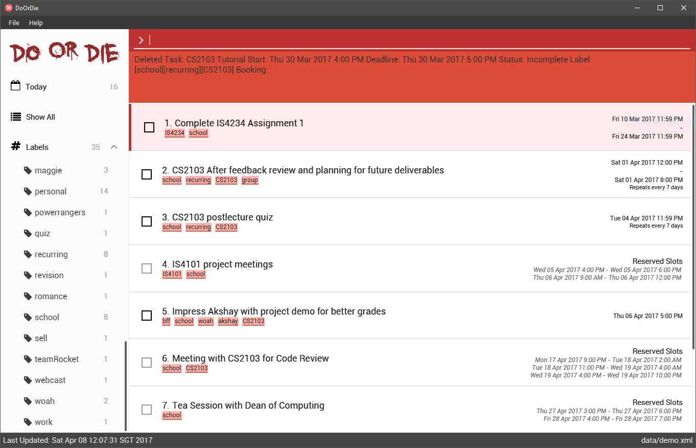

# DoOrDie - User Guide

Please refer to the [Setting up](DeveloperGuide.md#setting-up) section to learn how to set up DoOrDie.

---

1. [Start Project](#1-start-project)
2. [Features](#2-features)
3. [FAQ](#3-faq)
4. [Command Summary](#4-command-summary)

## 1. Start Project

1. Ensure you have Java version `1.8.0_111` or later installed in your computer. 

   > Having any Java 8 version is not enough.  
   > This app will not work with earlier versions of Java 8.

2. Download the latest `doordie.jar` from the [releases](../../../releases) tab.
3. Navigate to the location of the `doordie.jar` and double click the jar.
4. The GUI should appear in a few seconds.
 
If you get an error on saving the file, try running the jar file as an administrator.
5. Refer to the [Features](#features) section below for details of each command. 

## 2. Features

> **Command Format**
>
> * Words in `UPPER_CASE` are the parameters.
> * Items in `SQUARE_BRACKETS` are optional.
> * Items with `...` after them can have multiple instances.
> * Parameters can be in any order.
>
> **Acceptable Date and Time Input Format**
>
> | Date Format | Example |
| -------- | :-------- |
| Day Month | 1st Apr |
| Day Month Year | 1st Apr 2017, 1st April 17 |
| Month Day | Apr 1st |
| Month / Day | 12-1 |
| Month / Day / Year | 11/1/2017, 11/1/17 |
| Month - Day | 12-1 |
| Month - Day - Year | 12-1-2017, 11-1-17 |
| Relative | today, tmr, tomorrow, two days later |

> | Time Format | Example |
| -------- | :-------- |
| Hour:Min | 23:00 |
| Hour.Min | 23.00, 2.00, 02.00 |
| Hour am/pm (12 hour format) | 2am, 2AM, 2pm, 2PM |

>
> * Date specified without timing after the `by` and `to` keyword is default to 23:59 hr
> * Date specified without timing after the `from` keyword is default to 00:00 hr

### 2.1. Viewing help : `help`

Format: `help`

> * Help is also shown if you enter an incorrect command e.g. `abcd`

### 2.2. Adding a task: `add`

Adds a task to DoOrDie 
Format: `add TASKNAME [# LABEL...] ([by DEADLINE] | [from START_DATE to END_DATE]) [repeat every [number](hour(s)|day(s)|month(s)|year(s))]`

> * Tasks can have a deadline, or can do without one as well.
>   * Tasks added without specifying a deadline will be displayed under "No Deadline".
>   * Date formats can be flexible. The application is able to parse commonly-used human-readable date formats.
>     * e.g. `Monday`, `next wed`, `tomorrow`, `5 days after`, `4 Apr` etc.
> * Dates can include time as well.
>   * If only time is specified, it will default to 2359.
>   * If time is not specified, it will default to the current time of the particular date.
>   * Time formats are flexible as well. The application supports 24 hour format and AM/PM format.
>     * e.g. `Monday 3pm`, `today 1930`, `5:30pm`, `10.00 am`
> * Recurring task will display the first set of dates, a new task with next of dates is completed when you complete the previous task
> * Tasks can have any number of label name. (including 0).
> * The `add` command adds task without specifying `deadline`.
> * Tasks can be created for a date that is already passed.

Examples:

 * `add CS2106 Mid terms`
 * `add CS2103 V0.0 by tmr #module`
 * `add Make baby by next wednesday 11pm`
 * `add do laundry by today repeat every 6 days`

### 2.3 Listing all tasks : `list`

Shows a list of all tasks in DoOrDie. Able to filter by type of task (task), or based on status of task such as completed or outstanding.

Format: `list [TYPE]`

> * Valid parameters for TYPE:
>  * `tasks` / `task`
>  * `completed`
>  * `incomplete`
>  * `overdue` / `over`
>  * `by DATE`
>  * `from STARTDATE to ENDDATE`
>  * `bookings` / `booking`

Examples:

* `list` 
 Lists all tasks.

* `list overdue` 
 Lists all overdue tasks

* `list incomplete` 
 Lists all outstanding tasks

* `list completed` 
 Lists all completed tasks

* `list by today` 
 Lists all tasks due by today 23:59 hr

* `list from monday to friday` 
 Lists all tasks due within Monday 00:00 hr to Friday 23:59 hr

### 2.4. Editing a task : `edit`

Edits the specified task's details.

Format:`edit INDEX [TASKNAME] [label LABEL] ([(by) DATE] | [from START_DATE to END_DATE] | (clear dates) | [COMPLETED | INCOMPLETE] | (stop repeat)`  
or : `edit #OLD_LABEL #NEW_LABEL`

> * Edits the task with the `TASK_INDEX`
    The index refers to the index of the task. 
    The index **must be a positive integer** 1, 2, 3, ...
> * At least one of the optional fields excluding `TASK_INDEX` must be provided.
> * Existing values will be updated to the input values.
> * When editing labels, the existing labels of the task will be removed i.e adding of labels is not cumulative.
> * You can remove all the task's tags by typing `#` without specifying any tags after it.
> * You can mark a task completed or incomplete by specifying 'completed' or 'incomplete' respective.
> * Using 'clear dates' allows the user to remove the existing dates associated with the task.
> * Using 'stop repeat' allows the user to remove the recurrence of the recurring task.
> * When editing labels, OLD_LABEL should exist otherwise an error message will be displayed.

Examples:

* `update 1 label tedious work by thursday` 
  Edits the label and deadline of the task with id 1 to be `tedious work` and deadline to `Thursday 23:59 hr` respectively.

* `edit #friends #oldfriends` 
  Renames all task with the tag `friends` to `oldfriends`.

### 2.5. Changing status of a task: `mark`

Edits the specified task's status.

Format:`mark INDEX [COMPLETED | INCOMPLETE]`

> * Marks the task with the `TASK_INDEX` as completed/incomplete
    The index refers to the id of the task. 
    The index **must be a positive integer** 1, 2, 3, ...
> * You can mark a task completed or incomplete by specifying 'completed' or 'incomplete' respective.

Examples:

* `mark 3 completed` 
  Edits the status of the currently selected task at index 3 as completed.

### 2.6. Finding all task containing any keyword in task name and labels : `find`

Finds tasks whose name and labels containing any of the specified keywords.

Format: `find [TYPE] KEYWORD [MORE_KEYWORDS]...`

> Valid parameters:
> * `TaskName`
> * `LabelName`
> * `Complete` / `Completed`
> * `Incomplete` / `Outstanding`
> * `by DATE`
> * `DATE`
> * `from STARTDATE to ENDDATE`

> * The search is case insensitive and the order of the keywords does not matter.
> * Task names, label names, dates, bookings will be searched, and tasks with at least one keyword match will be return and display to user.

Examples:

* `find CS2103` 
Returns all task containing the keyword or label containing `CS2103` & `cs2103`.

* `find project` 
Returns all task with the name containing `project` & `Project`.

* `find ign` 
Returns all task with the name containing `ign` like `assignment` & `Assignments`.

* `find glocery` 
Returns all task with the label name containing `glocery` & `Glocery`.

* `find project glocery` 
Returns all tasks having name or label name containing `project`, `Project`,  `glocery`, `Glocery`.

### 2.7. Deleting a task : `delete`

Deletes the specified task from the task manager. Reversible via undo command.

Format: `delete (INDEX|#LABEL)`

> * Deletes the task at the specified `INDEX` or all task with `LABEL`.  
> * The index refers to the index of the task in the display list.
> * The index **must be a positive integer** 1, 2, 3, ...
> * If the label does not exist, command will still be executed but no change will occur

Examples:

* `delete` 
  Deletes the currently selected task in DoOrDie.
* `delete 2` 
  Deletes the task with the id `2` in the DoOrDie.
* `delete #school` 
  Deletes all task with the label `school`.

### 2.8. Add a booking : `book`

Reserve time slots for a certain task that has not been confirmed yet. 
Format: `book TASKNAME [#LABEL...] on DATE, DATE, [MORE_DATES]...`

> * Date formats can be flexible. The application is able to parse commonly-used human-readable date formats.
>   * e.g. `Monday`, `next wed`, `tomorrow`, `5 days after`, `4 Apr` etc.
> * Dates can include time as well.
>   * If only time is specified, it will default to today's date.
>   * If time is not specified, it will default to the current time of the particular date.
>   * Time formats are flexible as well. The application supports 24 hour format and AM/PM format.
>     * e.g. `Monday 3pm`, `today 19:30`, `5:30pm`, `10.00am`
> * Tasks can have any number of label name. (including 0).
> * DATES and MORE_DATES should be prefixed with a comma if there are multiple dates.

Examples:

* `book CS2103 Meeting on 1/1/2017 4pm to 6pm, 2/1/2017 8pm to 10pm` 
  Reserves time slots on the 1st January 2017 4pm to 6pm and 2nd January 8pm to 10pm for CS2103 Meeting

### 2.9. Confirm a booking : `confirm`

Confirm booking of a task and releases other bookings for the confirmed task. 
Format: `confirm TASK_INDEX SLOT_NUMBER`

> * SLOT_NUMBER will be respective to the dates added in that order
> * The index refers to the id of the task. 
> * The index **must be a positive integer** 1, 2, 3, ...

Examples:

* `book CS2103 Meeting on 1/1/2017 4pm to 5pm, 2/1/2017 8pm to 10pm` 
  `confirm 1 1` 
  Confirms the task CS2103 Meeting for 1st January 2017 4pm to 5pm and releases 2nd January 2017 8pm to 10pm time slot

### 2.10. Undo the previously executed command : `undo`

Revert results of a previously executed command. If the previously executed command does not modify the data of DoOrDie, nothing will be reverted. 
Format: `undo`

### 2.11. Clearing all entries : `clear`

Clears all entries from DoOrDie. 
Format: `clear`

### 2.12. Save current Task Manager to a specified location : `saveas`

Saves current Task Manager tasks to a location provided 
After saving, the Task Manager will save changes to the new location 
Format: `saveas FILEPATH_RELATIVE_TO_JAR`

> * FILEPATH_RELATIVE_TO_JAR must be a file ending with `*.xml`

### 2.13. Load data from a specified file to the Task Manager : `load`

Replaces all task with the newly loaded data in the specified file path 
After loading, the Task Manager will save changes to the new location 
Format: `load FILEPATH_RELATIVE_TO_JAR`

> * FILEPATH_RELATIVE_TO_JAR must be a file ending with `*.xml`

### 2.14. Exiting the program : `exit`

Exits DoOrDie 
Format: `exit`

### 2.15. Saving the data

DoOrDie data are saved in the hard disk automatically after any command that changes the data. 
There is no need to save manually.

### 2.16. Iterating through previously executed commands
Pressing the UP or DOWN key will allow you to iterate through previous commands executed (if any).

### 2.17. Autocompletion of commands and reserved keywords
Pressing the TAB key will auto complete the word at the current cursor if there is a match, otherwise a list of suggestions will be displayed.

### 2.18. Autofocus back to command line
There is no need to click on the text box to start typing. 
Typing any letter will set the focus back to the command line and sets the cursor to the end of the text field before entering that key

### 2.19. Edit booking time slots : `editbooking`
Edits booking time slots. 
Format: `editbooking INDEX (remove SLOT_NUMBER | change SLOT_NUMBER NEW_DATE | add DATE, MORE DATES)`

> * SLOT_NUMBER will be respective to the dates added in that order
> * The index refers to the id of the task in the task list currently displayed. 
> * The index **must be a positive integer** 1, 2, 3, ...
> * The time slot number **must be a positive integer** 1, 2, 3, ...

Examples:

* `book CS2103 Meeting on 1/1/2017 4pm to 5pm, 2/1/2017 8pm to 9pm` 
  `editbooking 1 add 3/1/2017 4pm to 5pm, 4/1/2017 8pm to 9pm` 
  Adds 3/1/2017 4pm to 5pm and 4/1/2017 8pm to 9pm to the booking CS2103 Meeting
* `editbooking 1 change 1 5/1/2017 3pm to 5pm` 
  Changes the time slot from `1/1/2017 4pm to 5pm` to `5/1/2017 3pm to 5pm` for booking CS2103 Meeting.
* `editbooking 1 remove 2` 
  Removes the time slot `2/1/2017 8pm to 9pm` from the booking CS2103 Meeting.

## 3. FAQ

**Q**: How do I transfer my data to another Computer? 
**A**: Install the app in the other computer and overwrite the empty data file it creates with the file that contains the data of your previous Task Mangager folder.

## 4. Command Summary

Command Description | Command Format | Example
-------- | :-------- | :---------
| Help | `help` |
| Add | `add TASKNAME [#LABEL...] [by DEADLINE] [repeat every [NUMBER](hours|days|months|years)]` | `add CS2106 Mid terms by tmr 13:00 #school`
| List | `list [TYPE]`| `list completed`
| Edit | `edit [TASK_INDEX] [TASKNAME] [#LABEL...] ([by DATE] | [from START_DATE to END_DATE] | clear dates | stop repeat) [completed|incomplete]` or `edit #OLD_LABEL #NEW_LABEL` | `edit 1 #label tedious work by thursday #work` or `edit #friends #allies`
| Mark | `mark [TASK_INDEX] [completed|incomplete]` | `mark 1 completed`
| Find | `find [TYPE] KEYWORD [MORE_KEYWORDS]...` | `find CS2103 ign`
| Delete | `delete [TASK_INDEX|#LABEL]` | `delete 1` or `delete #friends`
| Book | `book TASKNAME [#LABEL...] on DATE, [MORE_DATES]...` | `book CS2103 Meeting on 1/1/2017 4pm, 2/1/2017 8pm`
| Confirm | `confirm TASK_INDEX SLOT_NUMBER` | `confirm 1 1`
| Edit Booking | `editbooking TASK_INDEX (remove SLOT_NUMBER | change SLOT_NUMBER NEW_DATE | add DATE, MORE DATES...)` | `editbooking 1 add 3/1/2017 4pm to 5pm, 4/1/2017 8pm to 9pm` `editbooking 1 change 1 5/1/2017 3pm to 5pm`  `editbooking 1 remove 2`
| Undo | `undo` | `undo`
| Clear | `clear` | `clear`
| Save to a certain location | `saveas FILEPATH_RELATIVE_TO_JAR` | `saveas data/taskmanager2.xml`
| Load data from a different file | `load FILEPATH_RELATIVE_TO_JAR` | `load data/taskmanager2.xml`
| Exit | `exit` |
